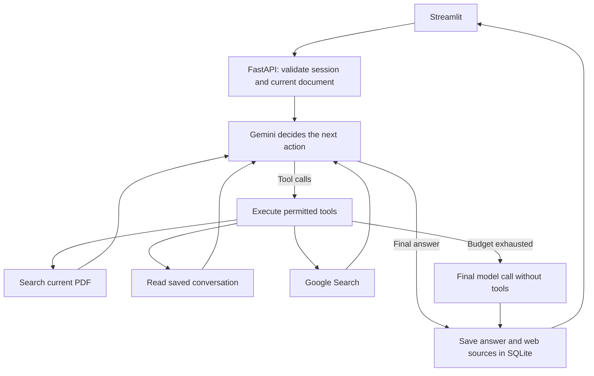

# LangGraph-Based Agentic RAG System for Document Q&A

A document-aware conversational assistant built with **FastAPI, Streamlit, LangChain, LangGraph, Gemini, and FAISS**. A single Agent can choose tools, inspect their results, and make additional tool calls before answering.

The current application runs its API, PDF processing, file storage, and SQLite database locally. Gemini inference and Google Search require internet access and a valid Google API key. Earlier AWS components remain in the repository for reference; they are not needed for local startup.

## Features

- General conversation without uploading a document.
- PDF question answering with session-scoped FAISS retrieval.
- Context-dependent follow-ups and questions about saved conversation history.
- Optional Google Search and combined document/web answers.
- Assistant and Strict Document modes with different tool permissions.
- Resumable anonymous conversations with persisted answers and web sources.
- One active PDF per conversation; replacing it removes old document-linked messages while preserving independent general/web turns.
- Tool execution records and retrieved document evidence displayed after each answer.
- Bounded execution with tool-call limits, a round limit, and a timeout.

## How the Agent works

**LangChain** provides the Gemini model integration, structured tool schemas, message types, text splitting, embeddings, and vector-store integration. **LangGraph** manages the model/tool execution loop and request-local state.



The Agent is a **single tool-using Agent**, not a multi-agent platform. It cannot run shell commands, modify project files, or autonomously operate the computer.

| Tool | Purpose | Availability |
|---|---|---|
| `document_search(query)` | Retrieve evidence from the current PDF | A document must be attached |
| `conversation_history()` | Read server-provided history and resolve follow-ups | Both modes; Strict mode filters eligible history |
| `web_search(query)` | Obtain current information with Google grounding | Assistant mode with search enabled |

The backend binds the session and document IDs. Tool arguments cannot override those IDs or specify arbitrary file paths. Unknown or disallowed tool calls are rejected.

### Response modes

- **Assistant:** can use document evidence, history, general model knowledge, and optional web search.
- **Strict Document:** requires a PDF and only permits document retrieval and eligible document/history turns. The web tool is not exposed. If no evidence is obtained, the system returns an evidence-unavailable response.

With the Agent engine, response categories describe observed tool use rather than an initial routing decision. Assistant-mode document answers are conservatively labeled `HYBRID` because general explanation is allowed. This label alone does not mean web search occurred.

## Local setup

Python **3.12** was used to validate the current stack. Run commands from the repository root.

### 1. Prepare the environment

For a new checkout:

```bash
git clone https://github.com/Outlier622/Document-Q-A.git
cd Document-Q-A
conda create -n rag_llm python=3.12
conda activate rag_llm
python -m pip install -r requirements.txt
```

If `rag_llm` already exists, activate it and install the current requirements; do not recreate it.

### 2. Configure `.env`

Create `.env` in the project root with the following settings. Replace the API-key placeholder with your own key. Do not commit `.env`.

```dotenv
GOOGLE_API_KEY=your_google_api_key
LLM_MODEL=gemini-3.5-flash
HUGGINGFACE_EMBEDDING_MODEL=all-MiniLM-L6-v2
CHUNK_SIZE=1000
CHUNK_OVERLAP=200
VECTOR_STORE_PATH=app/data/vectorstores/faiss_index
VECTOR_STORE_DIR=app/data/vectorstores

STORAGE_BACKEND=local
DOCUMENT_PROCESSING_MODE=sync
DATABASE_BACKEND=sqlite
SQLITE_DATABASE_PATH=app/data/app.db

QUERY_ENGINE=agent
AGENT_MAX_ROUNDS=4
AGENT_MAX_TOOL_CALLS=6
AGENT_TIMEOUT_SECONDS=180
AGENT_TOP_K=5
```

`LLM_MODEL` must be a model available to your Google account; the configured model above passed the live tool-loop smoke test. `VECTOR_STORE_PATH` is required for compatibility with the old shared-index endpoints. The main session-based UI builds a separate index for each uploaded PDF and does not require a prebuilt index at that default path.

### 3. Start the backend

```bash
python -m uvicorn app.main:app --reload --host 127.0.0.1 --port 8000
```

Wait for `Application startup complete` and check that no subsequent startup error appears.

### 4. Start the frontend in a second terminal

Activate the same environment and run:

```bash
python -m streamlit run frontend.py
```

- Frontend: [http://localhost:8501](http://localhost:8501)
- API documentation: [http://127.0.0.1:8000/docs](http://127.0.0.1:8000/docs)

Keep both terminals running. The Agent runs inside the backend; it does not need a third process. No Docker, SQS worker, or PostgreSQL service is required in local mode.

If Streamlit reports a refused connection, check the backend terminal first, then use **Retry connection** or refresh the page. The frontend currently connects to `http://localhost:8000`.

## Try the Agent

1. Select Assistant and ask a general question without uploading a PDF.
2. Ask what your previous question was; inspect the `conversation_history` tool record.
3. Upload a PDF whose content you know and ask a factual question; inspect `document_search` and the retrieved evidence.
4. Ask a follow-up that refers to the previous answer.
5. Enable Google Search and ask the Agent to retrieve a claim from the PDF, then verify it against current external sources.
6. Switch to Strict Document and request web verification; no web tool should execute.

Expand **Tools used** after the answer. A `completed` tool status means execution succeeded, not that every generated statement is correct. Check retrieved evidence and source links against the answer.

## Storage and persistence

```text
app/data/app.db
app/data/sessions/{session_id}/
    pdfs/{document_id}.pdf
    texts/{document_id}.txt
    vectorstores/faiss_index_{document_id}/
        index.faiss
        index.pkl
```

PDF upload synchronously extracts text with pdfplumber, splits it, generates embeddings, and saves FAISS artifacts. Large uploads can take time. The embedding model may need downloading on its first use.

SQLite stores sessions, final answers, categories, and web sources. The backend reads conversation history from the database rather than trusting a client's history payload. Stale document IDs are rejected, and answers tied to a replaced document cannot be saved as current-document turns.

Tool steps and retrieved document excerpts are response-only: they are not restored after a restart. Graph state is not checkpointed. Keeping the same browser `client_id` allows the conversation to resume, but this anonymous identifier is not authentication.

## Main implementation files

| Location | Responsibility |
|---|---|
| `app/agents/graph.py` | LangGraph state, model/tool loop, limits, result metadata |
| `app/agents/tools.py` | Session-bound document, history, and web tools |
| `app/services/query_context_service.py` | Resolve server-owned query context |
| `app/services/document_retrieval_service.py` | Reusable current-document retrieval |
| `app/services/web_search_service.py` | Gemini grounding and source extraction |
| `app/services/rag_service.py` | Query entry point, answer persistence, retained legacy pipeline |
| `app/services/session_service.py` | Session, history, and document ownership checks |
| `app/processing/` | PDF extraction, splitting, embeddings, and FAISS |
| `app/routes/rag_route.py` | HTTP endpoints |
| `frontend.py` | Streamlit interface |

The preferred endpoint is `POST /rag/assistant/query`; `POST /rag/query-by-document` remains compatible. Session start/resume, session end, and PDF upload retain their existing endpoints. See the generated API documentation for request schemas.

## Dependencies and compatibility

The validated local stack includes LangChain **1.4.0**, LangGraph **1.2.11**, and `langchain-google-genai` **4.4.0**. Exact local pins are in `requirements.txt`.

The former Google integration 2.1.8 discarded thought signatures required by the configured Gemini model during multi-turn tool calls. The current integration preserves those messages. Retained RetrievalQA functionality uses `langchain-classic`; text splitting uses `langchain-text-splitters`.

Set `QUERY_ENGINE=legacy` and restart the backend to use the earlier classifier pipeline with the current local dependencies. This changes orchestration, not the local storage settings.

## Validation

Run offline tests with a disposable SQLite database and scripted models:

```bash
python -B -m unittest discover -s tests -v
python -m pip check
```

Opt-in live Gemini smoke test, using synthetic history rather than user documents:

```bash
python -B tests/live_agent_smoke.py
```

Live tests use API quota and may incur charges.

Validation performed during Agent integration:

- **25 offline tests passed**, covering tool loops, permission checks, failures, limits, timeouts, session context, persistence, and endpoint compatibility.
- Live Gemini model -> history tool -> model execution passed.
- A live Google Search check returned grounding sources.
- Dependency checks passed in `rag_llm`.
- The project owner subsequently reported successful manual UI functionality testing; this is not a formal benchmark.

The older `evaluation/` results cover an earlier three-category conversational pipeline, not the current Agent. They should not be presented as Agent accuracy results. Representative PDF end-to-end evaluation and a controlled Agent-versus-legacy comparison remain future work.

## Current limitations

- One active PDF per session; no multi-document library.
- No user authentication or production-scale load validation.
- Old indexes do not contain reliable page-level citations; retrieved excerpts are not sentence-level attribution.
- Final web sources come from search metadata; intermediate grounding spans are not presented as citations of the final synthesized answer.
- No token streaming, persistent Agent checkpoints, or interrupted-run recovery.
- A timed-out graph cannot forcibly stop a synchronous SDK operation already running in a worker thread, though that request cannot save a late answer.
- No autonomous file editing, command execution, or multi-agent collaboration.

## Infrastructure

For Terraform configuration and usage instructions, see:
[Terraform README](infra/terraform/README.md)

## Retained AWS implementation

A new [Terraform infrastructure draft](infra/terraform/README.md) describes S3,
SQS, ECS/Fargate, RDS PostgreSQL, IAM, ECR, logs and secret containers for a future
deployment. It is a local-only Infrastructure as Code exercise: no AWS account
connection, plan, apply or resource deployment was performed. It does not change
the current local application. Network IDs, a tested image and secret values
remain prerequisites for any future deployment.

The repository retains local/S3 storage abstractions, SQS worker code, PostgreSQL support, `Dockerfile.ecs`, and `requirements.ecs.txt`. These document the earlier deployment approach. The AWS dependency manifest has **not** been migrated to the current Agent stack and is not the supported installation path for this version.

Local runtime data and credentials should not be added to commits. Existing historical data tracked by Git is not automatically removed by this update.

## Further documentation

- [Agent configuration, response fields, and execution limits](docs/agent_setup.md)
- [Foundation interfaces and session scoping](docs/foundation_interfaces.md)
- [Earlier evaluation framework](evaluation/README.md)

Based on the original [Document-QA-RAG-System-FastAPI](https://github.com/FaisalAhmedBijoy/Document-QA-RAG-System-FastAPI) project.
